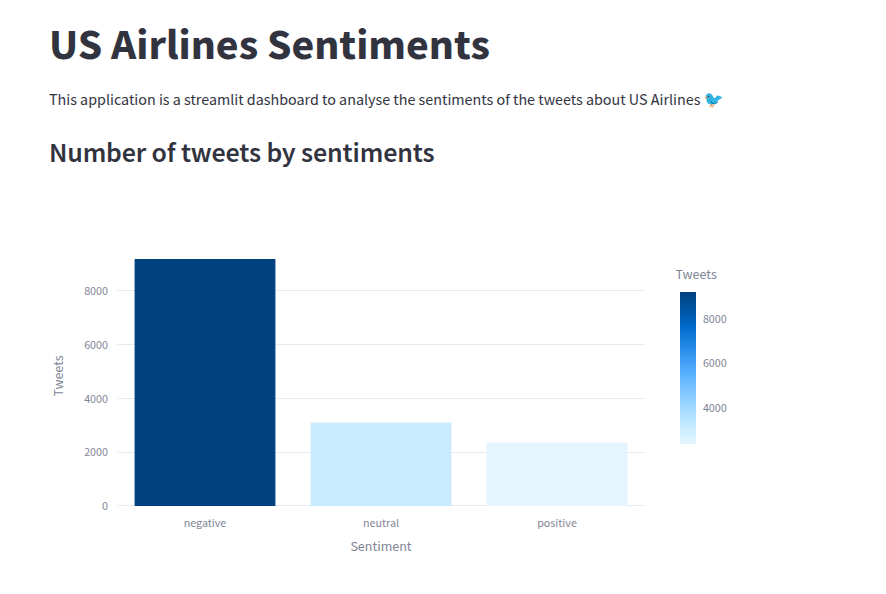
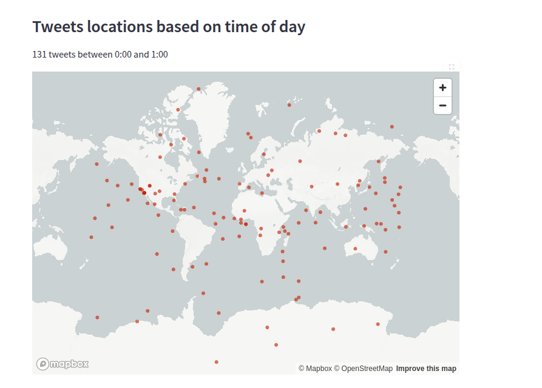
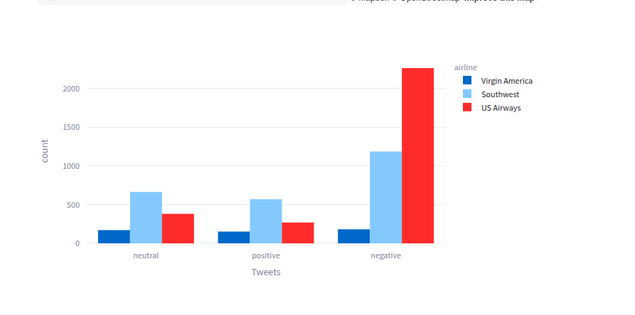
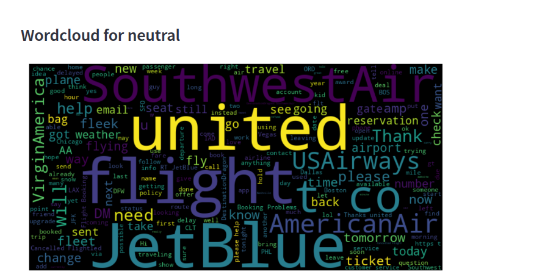
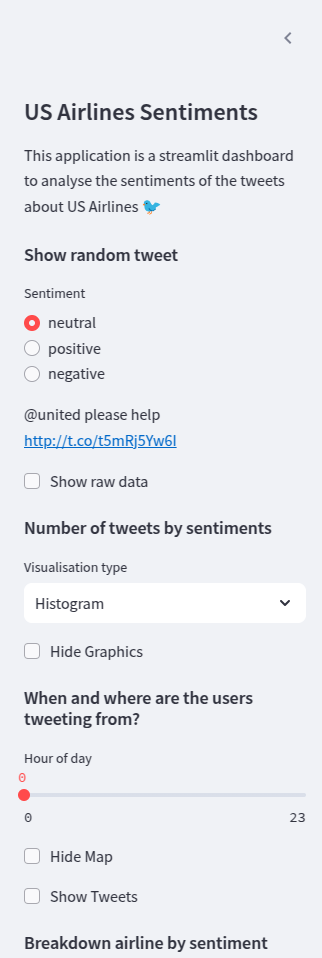
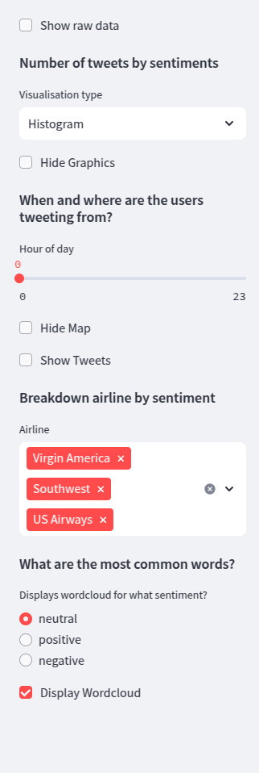
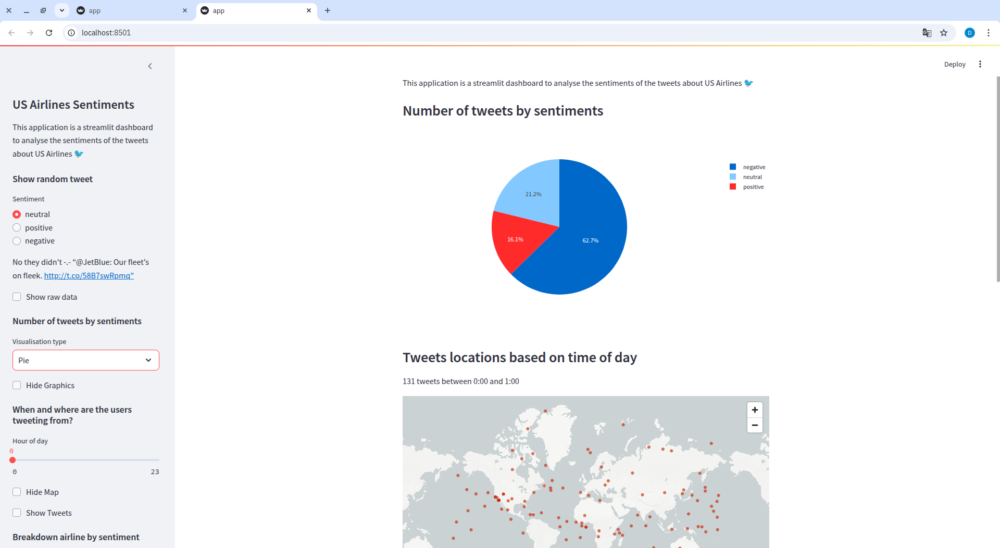

# 🐦 Tableau de Bord des Sentiments des Compagnies Aériennes Américaines ✈️

Ce projet est une application interactive développée avec [Streamlit](https://streamlit.io/) pour analyser les sentiments des tweets relatifs aux compagnies aériennes américaines. 

L'application permet d'explorer, de visualiser et de mieux comprendre les données textuelles concernant les avis des utilisateurs sur les compagnies aériennes.

---

## 🎯 Objectifs

- **Analyser les sentiments des tweets** sur les compagnies aériennes (positif, neutre, négatif).
- **Explorer les localisations et les heures des tweets** grâce à des cartes interactives.
- **Visualiser les données** via des graphiques (histogrammes, camemberts) et des nuages de mots.
- **Filtrer les données** par compagnies aériennes ou sentiments pour des analyses approfondies.

---

## 📋 Fonctionnalités

### 🌟 Chargement et Prétraitement des Données
- Chargement des tweets à partir du fichier `Tweets.csv`.
- Génération de coordonnées géographiques fictives pour les tweets sans localisation.

### 📊 Analyse Interactive
- Visualisation du **nombre de tweets par sentiment** (histogramme ou camembert).
- Affichage des **tweets localisés sur une carte** selon l'heure sélectionnée.
- Exploration des **tweets aléatoires** par sentiment.

### ☁️ Nuage de Mots
- Génération de nuages de mots pour afficher les mots les plus fréquents dans les tweets filtrés par sentiment.

### ✈️ Filtrage par Compagnie Aérienne
- Sélection de compagnies aériennes pour afficher la répartition des sentiments spécifiques.

---

## 📦 Structure du Projet

```
📦 US-Airlines-Project
├── app.py                   # Script principal de l'application Streamlit
├── Tweets.csv               # Jeu de données des tweets
├── README.md                # Documentation du projet
├── requirements.txt         # Liste des dépendances Python
```

---

## 🚀 Installation

Suivez les étapes ci-dessous pour configurer et exécuter l'application sur votre machine locale.

### 1️⃣ Cloner le dépôt :
```bash
git clone https://github.com/setoudie/US_Airlines_Sentiments.git
cd US_Airlines_Sentiments
```

### 2️⃣ Créer un environnement virtuel :
```bash
python3 -m venv env
source env/bin/activate  # Sur Windows : .\env\Scripts\activate
```

### 3️⃣ Installer les dépendances :
```bash
pip install -r requirements.txt
```

### 4️⃣ Lancer l'application :
```bash
streamlit run app.py
```

L'application sera accessible dans votre navigateur à l'adresse : `http://localhost:8501`.

---

## 📊 Jeu de Données

- **Source** : Fichier `Tweets.csv`.
- **Colonnes principales** :
  - `airline_sentiment` : Sentiment (positif, neutre, négatif).
  - `airline` : Compagnie aérienne associée au tweet.
  - `text` : Contenu du tweet.
  - `tweet_created` : Date et heure du tweet.
  - `tweet_coord` : Coordonnées géographiques (latitude, longitude).

---

## ⚙️ Fonctionnement de l'Application

### **Barre Latérale :**
- **Afficher un tweet aléatoire** : Sélectionnez un sentiment pour visualiser un tweet associé.
- **Filtrage des sentiments et compagnies** : Affichez les données spécifiques à une compagnie ou un sentiment.
- **Nuage de mots** : Génération d’un nuage de mots pour les tweets d’un sentiment donné.
- **Graphiques interactifs** :
  - Histogramme ou camembert pour la répartition des sentiments.
  - Carte interactive des localisations des tweets en fonction de l'heure.

### **Section Principale :**
- Affichage des données brutes (optionnel).
- Visualisation des tweets sous forme de graphiques ou de carte.
- Analyse des mots-clés avec des nuages de mots.

---

## 📋 Exemple d'Utilisation

1. **Filtrer par sentiment** : Sélectionnez "positif", "neutre" ou "négatif" pour voir les tweets correspondants.
2. **Visualisation des localisations** : Affichez les tweets géolocalisés pour une heure précise.
3. **Générer un nuage de mots** : Affichez les mots les plus fréquents associés à un sentiment spécifique.

---

## 🛠️ Technologies Utilisées

- **[Streamlit](https://streamlit.io/)** : Framework pour créer des applications web interactives.
- **[Pandas](https://pandas.pydata.org/)** : Analyse et manipulation des données.
- **[Plotly](https://plotly.com/)** : Visualisations interactives.
- **[Faker](https://faker.readthedocs.io/)** : Génération de données fictives (latitude, longitude).
- **[Matplotlib](https://matplotlib.org/)** et **[WordCloud](https://github.com/amueller/word_cloud)** : Génération de nuages de mots.

---

## 🔧 Dépendances

Le fichier `requirements.txt` contient toutes les dépendances nécessaires pour exécuter l'application. Installez-les avec :
```bash
pip install -r requirements.txt
```

---

## 📷 Capture d'Écran

lien de l'app : [US-Airlines](https://us-airlines-sentiments.streamlit.app/)




 




---

## 👨‍💻 Auteur

- **Seny Toutou Diedhiou**  
  - **Email** : senytoutou@gmail.com  
  - **GitHub** : [GitHub](https://github.com/setoudie)  
  - **LinkedIn** : [LinkedIn](https://linkedin.com/in/seny-toutou-diedhiou)  

---
